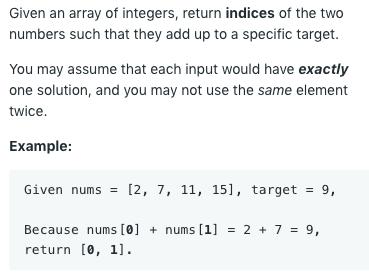

# 1. Two Sum (Easy)

## Description (_HashMap_)

<div  align="center">    



**Link:** https://leetcode.com/problems/two-sum/

</div>

### Note:
* For index, value in `enumerate(list)`
* check whether `target-num` in dictionary

```python
def twoSum(nums, target):
    dic = {}
    for index, num in enumerate(nums):
        if target - num in dic:
            return [dic[target-num], index]
        else:
            dic[num] = index
```

