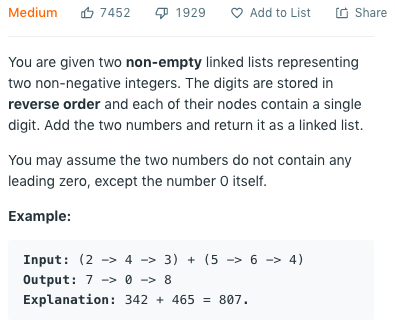

# 1. Add Two Numbers (Medium)

## Description (_Linked-list_)

<div  align="center">    



**Link:** https://leetcode.com/problems/add-two-numbers/

</div>

### Note:
* Iterative traverse the Linked list, need initialize with `head`, and use `l3=head`, `l3.next = ListNode(0)`, `l3=l3.next`
* The condition for `while` loop should be `l1 or l2 or carry`
* Doesn't need `if carry`:
    1. If both `l1` and `l2` be `None`, then `carry` is 0. Will skip `while`.
    2. If both `l1` and `l2` be `[0]`, then `carry` is 0. That is acceptable, so `if carry` will leads to mistake.
    3. `carry` will always be `None` later than `l1` and `l2`. So until break `while`, `carry` is not `None` and doesn't need to be tested.
* See the code, save code from 3 to 2 lines.

```python
# Definition for singly-linked list.
# class ListNode(object):
#     def __init__(self, x):
#         self.val = x
#         self.next = None

class Solution(object):
    def addTwoNumbers(self, l1, l2):
        """
        :type l1: ListNode
        :type l2: ListNode
        :rtype: ListNode
        """
        head = ListNode(0)
        l3 = head
        carry = 0
        while l1 or l2 or carry:
            if l1:
                carry += l1.val
                l1 = l1.next
            if l2:
                carry += l2.val
                l2 = l2.next
                
            #l3.next = ListNode(0)
            #l3 = l3.next
            #l3.val = carry % 10
            l3.next = ListNode(carry % 10)
            l3 = l3.next
            
            carry = carry // 10
        return head.next
```

